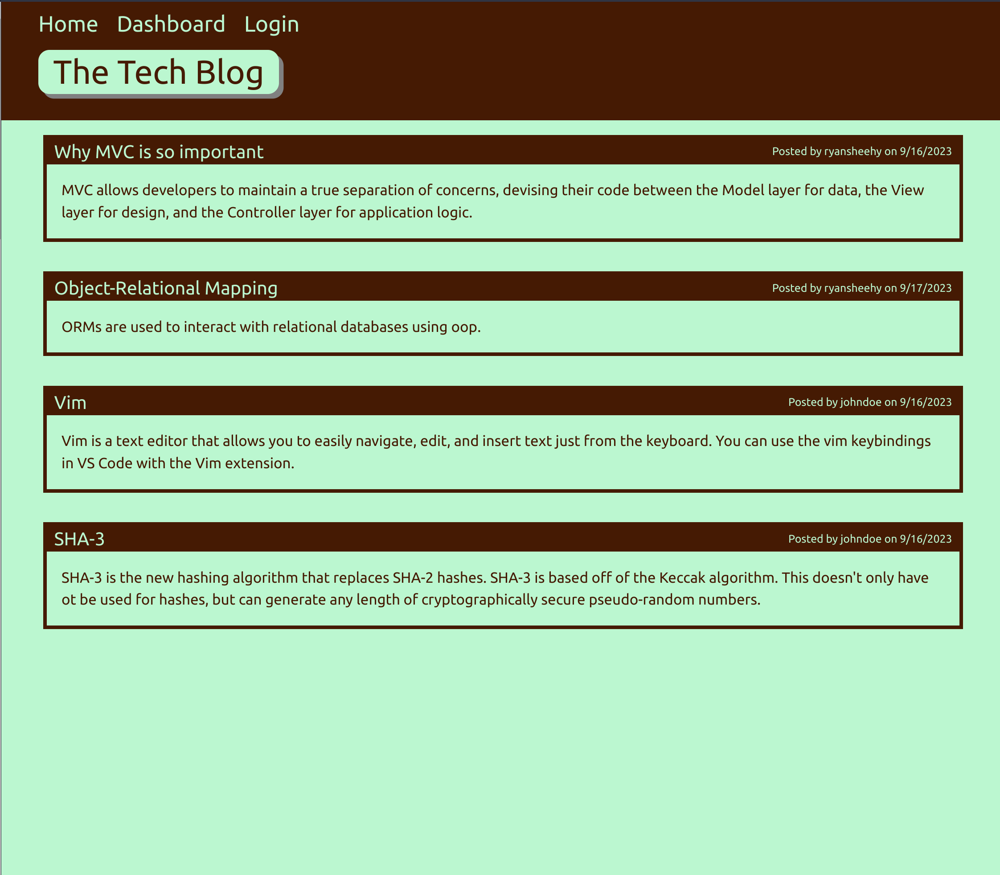
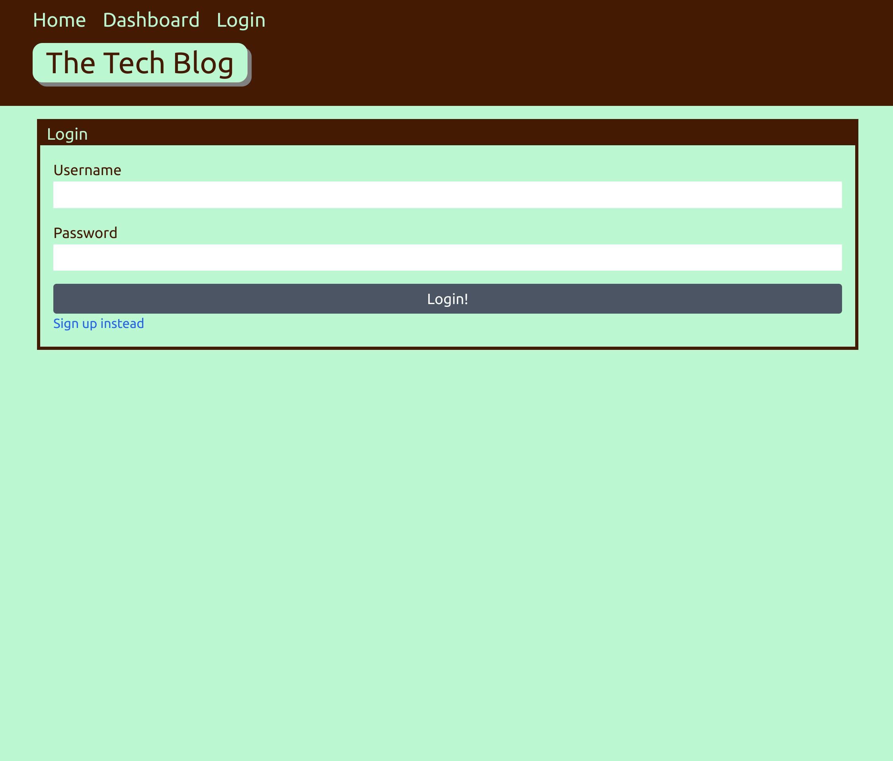
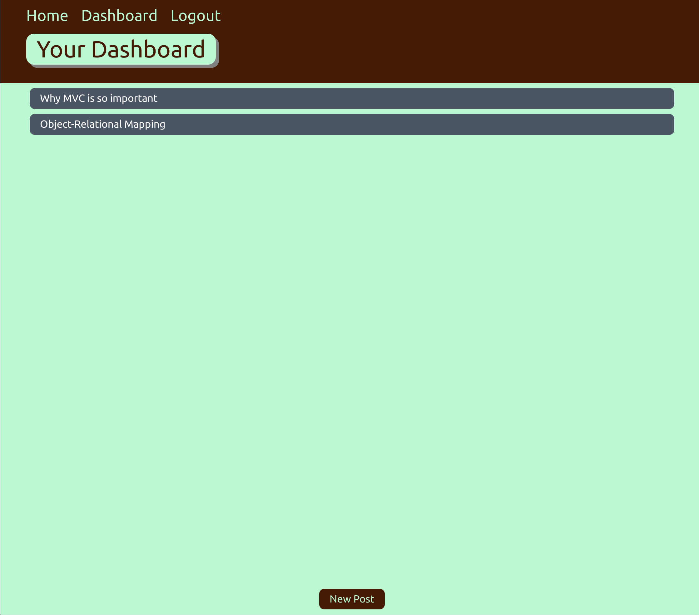

# CMS Blog Site

## Table of Contents
- [Description](#description)
- [License](#license)
- [Installation](#installation)
- [Usage](#usage)
- [Credits](#credits)
	- [Resources](#resources)
- [Tests](#tests)
- [Issues/Questions](#issuesquestions)
- [Contributing](#contributing)

## Description
A CMS blog site where developers can publish their blog posts and comment on other developers' posts.

## License

## Installation
First, clone the repo at `https://github.com/ryansheehy0/CMS_Blog_Site`.  Second, run `npm install` in the Develop folder.   Third, run `node server.js` in the Develop folder.

## Usage
If you aren't logged in you can look at all the posts on the home page.  You can create a new account by going to the ligin page and then click sign up in the bottom left.  Once you are logged in you can create new posts, edit existing posts, delete posts, and add comments to other people's posts.

## Credits

### Resources
- [bcrypt](https://www.npmjs.com/package/bcrypt)
- [dotenv](https://www.npmjs.com/package/dotenv)
- [express](https://www.npmjs.com/package/express)
- [express-handlebars](https://www.npmjs.com/package/express-handlebars)
- [express-session](https://www.npmjs.com/package/express-session)
- [mysql2](https://www.npmjs.com/package/mysql2)
- [sequelize](https://www.npmjs.com/package/sequelize)

## Tests
Just install and run the app.

## Issues/Questions
If you have any problems please specify what the problem is and the exact steps that lead you to your problem.

If you have any questions or issues feel free to reach out to me at

Github: [ryansheehy0](https://github.com/ryansheehy0)

or

Email: ryansheehy0@gmail.com

## Contributing
To contribute just make a pull request.